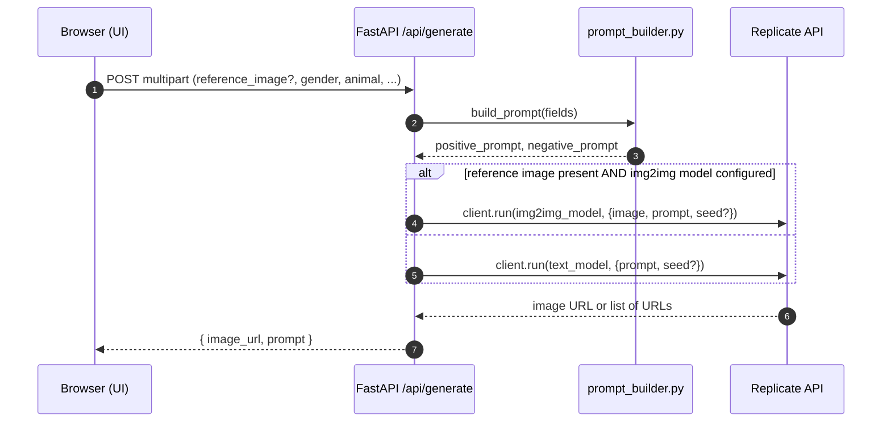

## Photogenic AI Studio — Architecture

### Goals
- Enable users to generate ~95% photorealistic portraits using multiple category inputs
- Support optional reference image for image-to-image guidance
- Keep stack simple: static web UI + FastAPI backend + Replicate API

### High-level Components
- **Frontend (static)**: `backend/static/index.html`, `styles.css`, `app.js`
  - Collects category inputs and optional reference image
  - Sends multipart POST to `/api/generate`
  - Renders generated image URL and the resolved prompt
- **Backend (FastAPI)**: `backend/main.py`
  - `POST /api/generate` endpoint
  - CORS enabled for easy local and multi-origin use
  - Serves static frontend (mounted after API routes)
- **Prompt Builder**: `backend/prompt_builder.py`
  - Transforms category selections into a concise photorealistic prompt
  - Returns `(positive_prompt, negative_prompt)`; only positive is sent by default for broad model compatibility
- **External Service**: Replicate (text-to-image and optional image-to-image)

### Configuration
Provided via environment variables (see `.env.example`):
- `REPLICATE_API_TOKEN` (required)
- `REPLICATE_MODEL` (default: `black-forest-labs/flux-1.1-pro`)
- `REPLICATE_IMAGE_TO_IMAGE_MODEL` (optional; used only if provided and a reference image is uploaded)

### Data Flow


### Component View
```mermaid
flowchart LR
  U[Browser (HTML/CSS/JS)] -- /api/generate --> B(FastAPI app)
  B -- build_prompt --> C[prompt_builder.py]
  B -- client.run --> R[Replicate]
  B -- serves static --> S[(Static files)]
```

### API Contract
- **POST** `/api/generate`
  - Content-Type: `multipart/form-data`
  - Fields:
    - `reference_image` (file, optional)
    - `gender`, `animal`, `expression`, `pose`, `outfit`, `lighting`, `camera`, `mood`, `background` (string, optional)
    - `seed` (number/string, optional; coerced to int if valid)
  - Response 200:
    ```json
    { "image_url": "https://...", "prompt": "...resolved positive prompt..." }
    ```
  - Error responses:
    - 400: Missing `REPLICATE_API_TOKEN`
    - 500: Replicate SDK missing or no image returned
    - 502: Upstream generation error

### Prompt Builder Strategy
- Start with: "a highly photorealistic portrait" (+ gender if provided)
- Append labeled segments for `expression`, `pose`, `outfit`, `lighting`, `camera`, `mood`, `background`
- Animal theme added as a subtle motif (keeps portrait primary)
- Global realism hints: skin texture, realistic lighting, shallow DoF, 4k, cinematic
- Negative prompt constructed but not passed (models differ in parameter naming); can be integrated per-model later

### Model Selection and Inputs
- Default to text-to-image using `REPLICATE_MODEL`
- If `reference_image` is provided and `REPLICATE_IMAGE_TO_IMAGE_MODEL` is set, switch to img2img
- Inputs sent conservatively: `prompt`, optional `seed`, and `image` for img2img (common key across many models)
- Output normalization:
  - Prefer last URL from list, else string URL, else `dict["image"]` best-effort

### Security & Safety Considerations
- **Authentication**: not required for demo; add API key or session auth for production
- **Input validation**: enforce allowed mime types for uploads, max file size (~5–10MB), and max prompt length
- **Content safety**: add optional moderation layer (e.g., prompt/image safety filters) before generation/display
- **Secrets**: do not expose `REPLICATE_API_TOKEN` to the browser; keep server-side only
- **Rate limiting**: apply per-IP rate limits (e.g., via proxy or middleware) to control costs

### Performance & Reliability
- Stateless backend; horizontal scaling via multiple Uvicorn workers/replicas
- Add request timeouts/retries on Replicate calls as needed
- Optional caching of recent generations (e.g., in-memory or Redis) to enable quick re-renders
- Structured logging around request/response timings; integrate Sentry or OpenTelemetry later

### Local Development
- Prereqs: Python 3.11+ / 3.12+ (compatible with used wheels), valid `REPLICATE_API_TOKEN`
- Run:
  ```bash
  cp .env.example .env
  # edit .env with your Replicate token and optional model overrides
  ./run.sh
  ```
- Visit: `http://localhost:8000/` and test generation
- Example curl (no reference image):
  ```bash
  curl -F gender=female -F expression="soft smile" -F lighting="golden hour" \
       -F camera="85mm portrait lens" http://localhost:8000/api/generate
  ```
- Example curl (with reference image, requires img2img model):
  ```bash
  curl -F reference_image=@/path/to/photo.jpg -F pose="three-quarter" \
       http://localhost:8000/api/generate
  ```

### Extensibility
- Add new categories: extend `prompt_builder.py` labels and add UI inputs
- Per-model tuning: introduce model-specific adapters to map negative prompts and extra controls (CFG, steps, guidance)
- Gallery/history: persist results to a database with signed URLs
- Job queue: offload generation to a worker for long-running models and progress updates
- Multi-provider: abstract a provider interface to support other APIs (Stability, SDXL, local engines)

### Files of Interest
- Backend: `backend/main.py`, `backend/prompt_builder.py`
- Frontend: `backend/static/index.html`, `backend/static/app.js`, `backend/static/styles.css`
- Env: `.env.example`
- Run: `run.sh`
